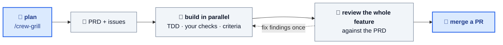

<div align="center">

# Coding Crew

### Describe a feature. Go to lunch. Come back to a reviewed PR.

**Your AI coding tool, upgraded from a pair programmer to a whole dev team.**

[](LICENSE)


</div>

---

Coding Crew plans a feature with you, breaks it into issues, then runs a crew of AI coders **in
parallel** — test-first, each in its own git worktree — and merges only what passes your checks and
an independent review. You get one PR at the end.

## Two commands

```bash
curl -fsSL https://raw.githubusercontent.com/ypxing/coding-crew/main/bootstrap.sh | bash
```

Then, inside Claude Code, Copilot CLI, Codex CLI or [pi](https://github.com/badlogic/pi-mono):

```bash
/crew-grill add rate limiting to the public API   # 👤 plan it together → PRD + issues
/crew-afk rate-limit --open-pr                    # 🤖 the crew builds it while you're away
```

## How it works



## Why teams use it

- ✅ **Test-first, always** — every coder works red-green-refactor.
- 🚦 **Nothing red merges** — each branch must pass your own checks and its acceptance criteria.
- 🔍 **A reviewer that sees the big picture** — catches missing requirements and loose ends no single branch shows.
- 🔁 **Self-correcting, never looping** — findings get fixed once, a closing review checks the fix, then it stops.
- 💸 **Every dollar accounted for** — a cost summary for each sprint, by role.
- 👀 **Watch live, or don't** — stream workers into [orca](https://www.onorca.dev) or [herdr](https://herdr.dev) panes.
- 🔒 **You stay in control** — nothing is pushed unless you ask.

## The toolkit

| Command                  | What it does                                               |
| ------------------------ | ---------------------------------------------------------- |
| `/crew-grill`            | Stress-test a plan → PRD + issues                          |
| `/crew-brainstorm`       | Shape a fuzzy idea → design → PRD + issues                 |
| `/crew-afk`              | Run the unattended sprint                                  |
| `/address-pr-comments`   | Fix PR review comments, push once your checks pass         |
| `/solve-issue`           | Build one issue end to end, yourself                       |
| `/write-pr`              | Write a PR description a reviewer can act on               |
| `/configure-tracker`     | Keep issues as local markdown or in GitHub Issues          |

## Learn more

- [User guide](docs/guide.md#part-2-using-this-repo-in-your-project) — install options, configuration, the full pipeline, troubleshooting
- [Contributor guide](docs/guide.md#part-1-contributing-to-this-repo) — adding skills and evolving the crew

## Acknowledgements

Several skills are borrowed from [Matt Pocock's skills collection](https://github.com/mattpocock/skills)
(MIT License, Copyright © 2026 Matt Pocock). See [LICENSE](LICENSE) for the full notice. Thanks Matt.

The `/crew-grill` design pipeline incorporates ideas from
[obra/superpowers](https://github.com/obra/superpowers). Thanks Jesse.
