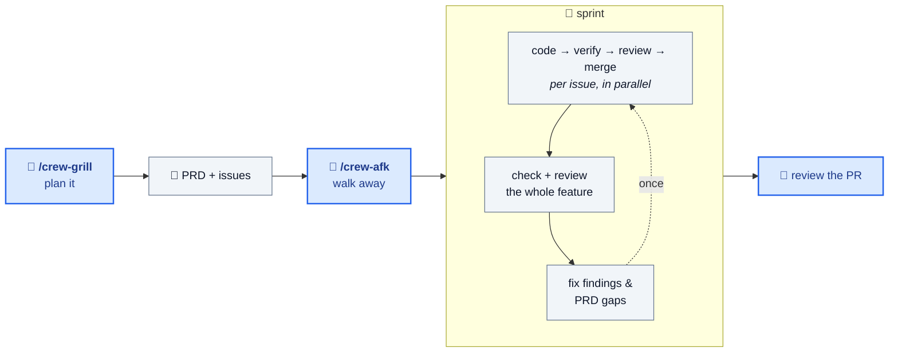

<div align="center">

# Coding Crew

**Turn an idea into merged, tested, reviewed code — while you're away from the keyboard.**

[](LICENSE)


</div>

Describe a feature → get a PR. Coding Crew plans it with you, splits it into issues, and runs
AI coders in parallel — test-first, each in its own git worktree — merging only what passes your
checks and an independent review.

Works with **Claude Code**, **GitHub Copilot CLI**, **OpenAI Codex CLI** and
[**pi**](https://github.com/badlogic/pi-mono).

## Install

```bash
curl -fsSL https://raw.githubusercontent.com/ypxing/coding-crew/main/bootstrap.sh | bash
```

Installs for every supported platform into your home directory, so it works in any project.
Needs `bash` 4+, `git`, `jq`, `curl` and `tar` (on Windows, use WSL2).
For a single platform, a per-project install or updates, see [Install options](#install-options).

## Quick start

In your project, inside your AI coding tool:

```bash
/crew-grill add rate limiting to the public API   # plan it → PRD + issues, filed under a feature name, e.g. rate-limit
/crew-afk rate-limit --open-pr                    # build that feature unattended, then open the PR
```

Come back to a PR whose every branch passed your checks and a review.

## How it works



What you can rely on:

- ✅ **Test-first** — every coder uses TDD in its own worktree.
- 🚦 **Nothing red merges** — each branch must pass your project's own checks.
- 🔍 **Independent review** — a separate agent reviews every branch, then the whole feature.
- 🔁 **Self-correcting** — failed checks, unmet criteria and actionable findings go back for a fix.
- 📋 **PRD-audited** — requirements no issue covered become new issues.
- 🔒 **Nothing pushed unless you ask** — `--open-pr` opens the PR; otherwise you get the command.

Full pipeline, gates and retry rules: [user guide](docs/guide.md#system-overview).

## Options

```bash
/crew-afk --open-pr             # push and open the PR at the end
/crew-afk --model opus          # coder model (default: sonnet)
/crew-afk --max-parallel 2      # fewer concurrent coders
/crew-afk --fix-findings none   # don't auto-fix review findings
```

Persist them in `.coding-crew/config.json` — e.g. `{ "afk": { "openPr": true } }`. Need `.env` in
worktrees? It's copied automatically; list other gitignored files in `.worktreeinclude`.
[All settings →](docs/guide.md#configuring-crew-afk)

## All commands

| Command                  | Use it to                                                                               |
| ------------------------ | --------------------------------------------------------------------------------------- |
| `/crew-grill`            | Stress-test a plan → PRD + issues. Add `with docs` to also update `CONTEXT.md` and ADRs |
| `/crew-brainstorm`       | Explore an unformed idea → design → PRD + issues                                        |
| `/crew-afk`              | Run the unattended sprint over all `ready-for-agent` issues                             |
| `/crew-address-findings` | Triage and fix the sprint's review findings                                             |
| `/solve-issue`           | Implement one issue yourself, end to end                                                |
| `/to-prd`, `/to-issues`  | Run just the PRD step or just the issue-splitting step                                  |
| `/address-pr-comments`   | Fix sensible GitHub PR review comments and reply to them                                |
| `/write-pr`              | Write a PR body for reviewers: Summary diagram, before/after Evidence, Merge Danger     |
| `/configure-tracker`     | Choose where issues live: local markdown files (default) or GitHub Issues               |

Optional: auto-fix PR review comments with [GitHub Actions](docs/guide.md#pr-rework-with-github-actions-optional).

## Install options

<details>
<summary>Single platform, per-project install, updates, uninstall</summary>

`bootstrap.sh` takes the same arguments as `install.sh`:

```bash
curl -fsSL https://raw.githubusercontent.com/ypxing/coding-crew/main/bootstrap.sh | bash -s -- claude             # one platform
curl -fsSL https://raw.githubusercontent.com/ypxing/coding-crew/main/bootstrap.sh | bash -s -- claude --project   # this project only
curl -fsSL https://raw.githubusercontent.com/ypxing/coding-crew/main/bootstrap.sh | bash -s -- --update           # update an install
```

| Argument                              | Effect                                              |
| ------------------------------------- | --------------------------------------------------- |
| `claude` / `copilot` / `pi` / `codex` | Install for that platform only (default: all)       |
| `--project`                           | Install into the current project instead of `$HOME` |
| `--update`                            | Apply updates to an existing install                |

Where files land:

| Platform    | Per project                          | User level (honors)                                    |
| ----------- | ------------------------------------ | ------------------------------------------------------ |
| Claude Code | `.claude/`                           | `~/.claude/` (`CLAUDE_CONFIG_DIR`)                     |
| Copilot     | `.github/skills/`                    | `~/.copilot/` (`COPILOT_HOME`)                         |
| pi          | `.pi/`                               | `~/.pi/agent/` (`PI_CODING_AGENT_DIR`)                 |
| Codex       | `.agents/skills/`                    | `~/.agents/skills/` (`CODEX_HOME`)                     |

Requirements for `/crew-afk`:

- The platform's **CLI must be on `PATH`** (`claude`, `copilot`, `codex` or `pi`) — each coder runs
  as its own process. `crew-afk doctor` reports anything missing.
- **Codex and pi:** local CLI only. Hosted surfaces (Codex in ChatGPT, Codex cloud) can't run a sprint.

Uninstall:

```bash
curl -fsSL https://raw.githubusercontent.com/ypxing/coding-crew/main/unbootstrap.sh | bash
```

</details>

## Learn more

- [User guide](docs/guide.md#part-2-using-this-repo-in-your-project) — writing issues, issue
  lifecycle, configuration, reading the logs, troubleshooting
- [Contributor guide](docs/guide.md#part-1-contributing-to-this-repo) — adding agents and skills,
  registry schema, security rules

## Acknowledgements

Several skills are borrowed from [Matt Pocock's skills collection](https://github.com/mattpocock/skills)
(MIT License, Copyright © 2026 Matt Pocock). See [LICENSE](LICENSE) for the full notice. Thanks Matt.

The `/crew-grill` design pipeline incorporates ideas from
[obra/superpowers](https://github.com/obra/superpowers). Thanks Jesse.
