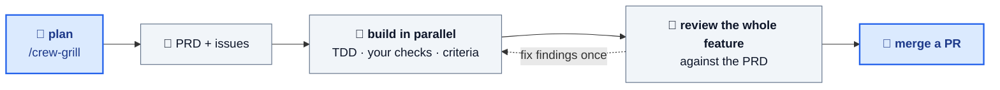

<div align="center">

# Coding Crew

### Describe a feature. Go to lunch. Come back to a reviewed PR.

**Turn the AI coding tool you already use into a whole dev team: a planner, parallel coders, a reviewer, and a teammate you can ask what happened.**

[](LICENSE)


</div>

---

A coding agent pairs with you one prompt at a time. Coding Crew works more like a team: you agree the
plan together, then it builds the feature **in parallel, test-first, each issue in its own git
worktree**. It merges only what passes your checks and an independent review, and you get one PR at
the end.

## Get going in two commands

```bash
curl -fsSL https://raw.githubusercontent.com/ypxing/coding-crew/main/bootstrap.sh | bash
```

Then, inside Claude Code, Copilot CLI, Codex CLI or [pi](https://github.com/badlogic/pi-mono):

```bash
/crew-grill add rate limiting to the public API   # 👤 plan it together → PRD + issues
/crew-afk rate-limit --open-pr                    # 🤖 the crew builds it while you're away
```

That's the whole workflow.

## How it works



1. **Plan.** `/crew-grill` questions your idea until the edge cases are decided, then splits the work
   into small issues with testable acceptance criteria. If you're starting from a fuzzy idea,
   `/crew-brainstorm` shapes it first.
2. **Build.** `/crew-afk` hands each issue to its own coder, several at a time. Every branch has to
   pass your own checks and meet its acceptance criteria before it merges.
3. **Review.** A reviewer reads the whole feature against the plan and catches what no single branch
   shows. The crew fixes the findings once, a closing review checks the fix, and the run stops.
4. **Ship.** You review one PR.

## Why teams use it

- ✅ **Test-first, always.** Every coder works red, green, refactor.
- 🚦 **Nothing red merges.** Your own checks are the gate, not the model's opinion of its own work.
- 🔍 **A reviewer that sees the whole feature.** It reviews against the plan, not one diff at a time.
- 🔁 **Fixes itself without looping.** One fix round, one closing check, then it stops.
- 💸 **You see what it cost.** Every sprint ends with a cost summary by role.
- 💬 **You can ask the crew what happened.** Under [orca](https://www.onorca.dev) or [herdr](https://herdr.dev), every sprint gets its own watch agent. Ask it what finished or what's blocked. Or ask for follow-up work on the feature branch, like fixing the review findings or answering PR comments.
- 🔒 **You stay in control.** Nothing is pushed unless you ask.
- 🧩 **Fits what you already use.** It works with four coding CLIs, and keeps issues as local markdown or in GitHub Issues.

## The toolkit

| Command                  | What it does                                               |
| ------------------------ | ---------------------------------------------------------- |
| `/crew-grill`            | Stress-test a plan and turn it into issues                 |
| `/crew-brainstorm`       | Shape a fuzzy idea into a design, then issues              |
| `/crew-afk`              | Run the unattended sprint                                  |
| `/crew-address-findings` | Fix what the sprint's review found                         |
| `/address-pr-comments`   | Fix PR review comments, push once your checks pass         |
| `/solve-issue`           | Build one issue end to end, yourself                       |
| `/add-tests`             | Find risky untested code and plan tests for it             |
| `/write-pr`              | Write a PR description a reviewer can act on               |
| `/configure-tracker`     | Choose local markdown or GitHub Issues                     |

## Learn more

- [User guide](docs/guide.md#part-2-using-this-repo-in-your-project): install options, configuration, the full pipeline, troubleshooting
- [Contributor guide](docs/guide.md#part-1-contributing-to-this-repo): adding skills and evolving the crew

## Acknowledgements

Several skills are borrowed from [Matt Pocock's skills collection](https://github.com/mattpocock/skills)
(MIT License, Copyright © 2026 Matt Pocock). See [LICENSE](LICENSE) for the full notice. Thanks Matt.

The `/crew-grill` design pipeline incorporates ideas from
[obra/superpowers](https://github.com/obra/superpowers). Thanks Jesse.
