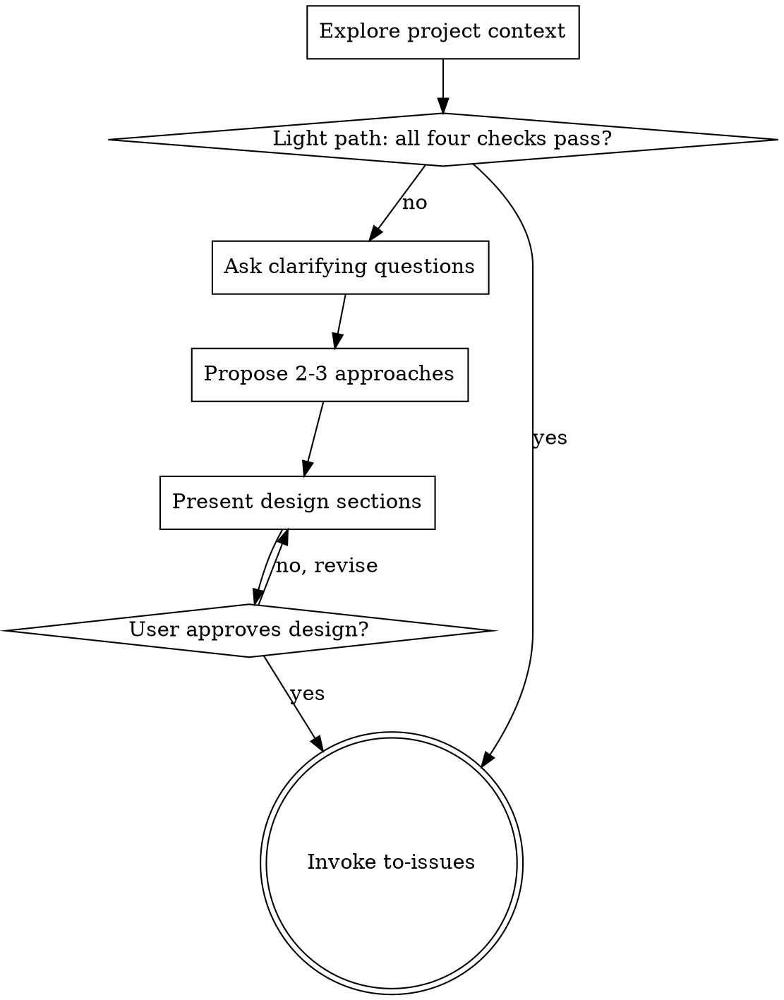

# Brainstorming Ideas Into Designs

Help turn ideas into fully formed designs and specs through natural collaborative dialogue.

Start by understanding the current project context, then ask questions one at a time to refine the idea. Once you understand what you're building, present the design and get user approval.

<HARD-GATE>
Do NOT invoke any implementation skill, write any code, scaffold any project, or take any implementation action until the design is settled: either you presented it and the user approved it, or the source passed all four light-path checks and went to `to-issues`, whose quiz is the single review. Nothing else skips the design.
</HARD-GATE>

## Anti-Pattern: "This Is Too Simple To Need A Design"

Every project goes through this process, unless the source already passes all four light-path checks (then `to-issues` is the review). A todo list, a single-function utility, a config change — "simple" is not that exemption; only the four checks are. "Simple" projects are where unexamined assumptions cause the most wasted work. Otherwise the design can be short (a few sentences for truly simple projects), but you MUST present it and get approval.

## Checklist

You MUST complete these items in order:

1. **Explore project context** — check files, docs, recent commits
2. **Judge the light path** — if the source is already one complete change, skip to step 6
3. **Ask clarifying questions** — one at a time, understand purpose/constraints/success criteria, and size the problem first (look up how often it happens and what it costs in git history, merged PRs and the tracker; ask only what no source holds)
4. **Propose 2-3 approaches** — with trade-offs and your recommendation; one is always the do-least option
5. **Present design** — in sections scaled to their complexity, get user approval after each section
6. **Hand off** — invoke `to-issues`, passing the agreed design (decisions, facts, cut list)

## Process Flow

```dot
digraph brainstorming {
    "Explore project context" [shape=box];
    "Ask clarifying questions" [shape=box];
    "Propose 2-3 approaches" [shape=box];
    "Present design sections" [shape=box];
    "User approves design?" [shape=diamond];
    "Invoke to-issues" [shape=doublecircle];

    "Light path: all four checks pass?" [shape=diamond];

    "Explore project context" -> "Light path: all four checks pass?";
    "Light path: all four checks pass?" -> "Invoke to-issues" [label="yes"];
    "Light path: all four checks pass?" -> "Ask clarifying questions" [label="no"];
    "Ask clarifying questions" -> "Propose 2-3 approaches";
    "Propose 2-3 approaches" -> "Present design sections";
    "Present design sections" -> "User approves design?";
    "User approves design?" -> "Present design sections" [label="no, revise"];
    "User approves design?" -> "Invoke to-issues" [label="yes"];
}
```

**The terminal state is invoking `to-issues`.** Do NOT invoke any implementation skill. The ONLY skill you invoke after brainstorming is `to-issues`.

## The Process

**Understanding the idea:**

- Check out the current project state first (files, docs, recent commits)

{{FRAGMENT:light-path}}

- Before asking detailed questions, assess scope: if the request describes multiple independent subsystems (e.g., "build a platform with chat, file storage, billing, and analytics"), flag this immediately. Don't spend questions refining details of a project that needs to be decomposed first.
- If the project is too large for a single spec, help the user decompose into sub-projects: what are the independent pieces, how do they relate, what order should they be built? Then brainstorm the first sub-project through the normal design flow. Each sub-project gets its own pass through `to-issues`.
- For appropriately-scoped projects, ask questions one at a time to refine the idea
- Prefer multiple choice questions when possible, but open-ended is fine too
- Only one question per message - if a topic needs more exploration, break it into multiple questions
- Focus on understanding: purpose, constraints, success criteria
- Size the problem before any solution: how often it happens, what the manual workaround costs today, and what goes wrong if nothing is done. Look these up (git history, the tracker, the code) before asking. Solutions the user arrives with are inputs, not the menu.

**Exploring approaches:**

- Propose 2-3 different approaches with trade-offs. One is always the **do-least option** — the smallest change, down to "do it by hand" or "leave it" — with its cost in terms of the problem size

{{FRAGMENT:design-standard}}

- Recommending anything larger needs evidence that the do-least option falls short, on the problem or on structure; "it doesn't cover every case" is not that evidence unless the uncovered case is costly
- Name the follow-on components each approach drags in, so its full price is visible when the user picks
- The do-least option sits inside the question; it never replaces asking. Ask what only the user can answer, and treat what they stated as a requirement as a given: price it, never relitigate it, and challenge it only with a question
- Present options conversationally with your recommendation and reasoning
- Lead with your recommended option and explain why

**Presenting the design:**

- Once you believe you understand what you're building, present the design
- Scale each section to its complexity: a few sentences if straightforward, up to 200-300 words if nuanced
- Ask after each section whether it looks right so far
- Cover: architecture, components, data flow, error handling, testing
- Be ready to go back and clarify if something doesn't make sense
- Before asking for final approval, run a **subtraction pass**: for each component, name the part of the problem, or the structural property of what is built now, that breaks if it is removed. "Another component needs it" is not an answer: follow the chain to its root and judge the root against the problem size, showing the chain's total price. "Nothing breaks" is a claim to check and cite, not assume. If nothing breaks, propose cutting it, and show what you cut
- After the subtraction pass and still before final approval, run the verification pass:

{{FRAGMENT:verification-pass}}

- Then ask for final approval of the whole design, showing what you cut and every correction the verification pass made

**Design for isolation and clarity:**

- Break the system into smaller units that each have one clear purpose, communicate through well-defined interfaces, and can be understood and tested independently
- For each unit, you should be able to answer: what does it do, how do you use it, and what does it depend on?
- Can someone understand what a unit does without reading its internals? Can you change the internals without breaking consumers? If not, the boundaries need work.
- Smaller, well-bounded units are also easier for you to work with - you reason better about code you can hold in context at once, and your edits are more reliable when files are focused. When a file grows large, that's often a signal that it's doing too much.

**Working in existing codebases:**

- Explore the current structure before proposing changes. Follow existing patterns.
- Where existing code has problems that affect the work (e.g., a file that's grown too large, unclear boundaries, tangled responsibilities), include targeted improvements as part of the design - the way a good developer improves code they're working in.
- Don't propose unrelated refactoring. Stay focused on what serves the current goal.

## After the Design

Once the user approves the design, invoke `to-issues`, passing the agreed decisions, facts and cut list. `to-issues` alone decides whether a PRD is written and what the slug is; do not ask the user for either.

- Do NOT invoke any other skill. `to-issues` is the only path forward.

## Key Principles

- **One question at a time** - Don't overwhelm with multiple questions
- **Multiple choice preferred** - Easier to answer than open-ended when possible
- **YAGNI for needs, not for structure** - Cut anything built for a need nobody has yet; keep what the current problem, or the structure of what is built now, requires
- **Explore alternatives** - Always propose 2-3 approaches before settling
- **Incremental validation** - Present design, get approval before moving on
- **Be flexible** - Go back and clarify when something doesn't make sense
